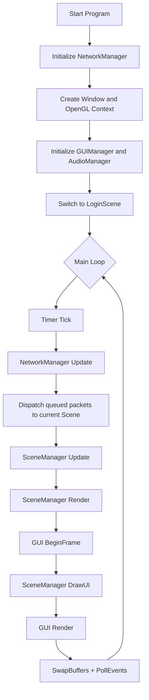
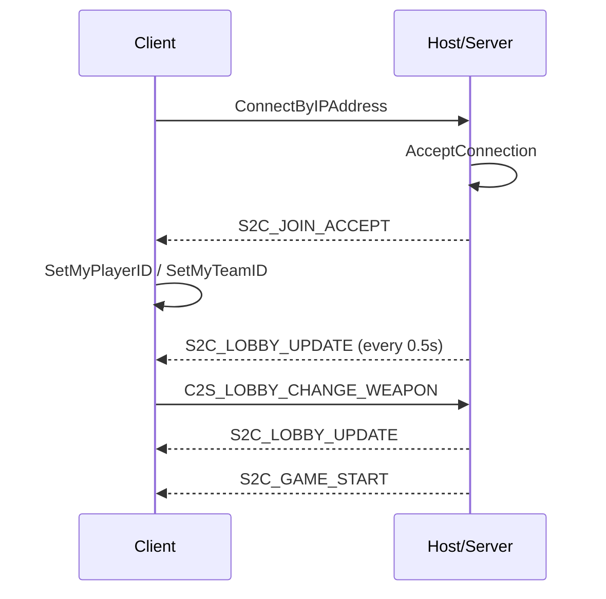

# Software Design Document: `Tiny-Splatoon`

> Implementation-based SDD. This document records the project as it is currently implemented in the repository.

---

## Table of Contents

1. [Project Overview](#1-project-overview)
   - [1.1 Product Summary](#11-product-summary)
   - [1.2 Runtime Flow](#12-runtime-flow)
   - [1.3 Build and Dependencies](#13-build-and-dependencies)
2. [System Architecture](#2-system-architecture)
   - [2.1 Module Layout](#21-module-layout)
   - [2.2 Main Loop](#22-main-loop)
   - [2.3 Scene Lifecycle](#23-scene-lifecycle)
3. [Scene Specifications](#3-scene-specifications)
   - [3.1 Login Scene](#31-login-scene)
   - [3.2 Lobby Scene](#32-lobby-scene)
   - [3.3 Game Scene](#33-game-scene)
4. [Networking Specification](#4-networking-specification)
   - [4.1 Transport Model](#41-transport-model)
   - [4.2 Packet Types](#42-packet-types)
   - [4.3 Join and Lobby Flow](#43-join-and-lobby-flow)
   - [4.4 In-Game Sync Flow](#44-in-game-sync-flow)
5. [Gameplay Specification](#5-gameplay-specification)
   - [5.1 World Model](#51-world-model)
   - [5.2 Player State Machine](#52-player-state-machine)
   - [5.3 Weapons and Projectiles](#53-weapons-and-projectiles)
   - [5.4 Specials and Items](#54-specials-and-items)
   - [5.5 Combat, Death, and Respawn](#55-combat-death-and-respawn)
   - [5.6 Match Timer and Endgame](#56-match-timer-and-endgame)
6. [Ink / Splat System](#6-ink--splat-system)
7. [Rendering and UI](#7-rendering-and-ui)
8. [Map and Assets](#8-map-and-assets)
9. [Implementation Notes and Known Gaps](#9-implementation-notes-and-known-gaps)

---

## 1. Project Overview

### 1.1 Product Summary

`Tiny-Splatoon` is a small 3D multiplayer ink-shooting game built with:

- `C++17`
- `OpenGL 4.5`
- `GLFW + GLAD`
- `ImGui`
- `miniaudio`
- `Valve GameNetworkingSockets`

Core gameplay:

- Two teams: Team 1 = red, Team 2 = green
- Players move in a 3D arena and paint the map with projectiles
- Ink affects score and movement state
- Players can swim only on their own ink
- The match duration is `180` seconds
- The host uses a `listen server` model and also participates as a player

The implementation is organized around:

- a single-threaded main loop
- a scene system (`Login -> Lobby -> Game`)
- a singleton network manager
- a `GameWorld` that owns gameplay simulation
- an ink painting system backed by texture + CPU grid data

### 1.2 Runtime Flow

### 1.3 Build and Dependencies

Build system:

- `CMake`
- `vcpkg`

Declared dependencies in `CMakeLists.txt` / `vcpkg.json`:

- `fmt`
- `glad`
- `glfw3`
- `glm`
- `imgui` with `glfw-binding` and `opengl3-binding`
- `opengl`
- `stb`
- `gamenetworkingsockets`

Post-build behavior:

- `assets/` is copied to the executable output directory

---

## 2. System Architecture

### 2.1 Module Layout

| Module | Responsibility |
|---|---|
| `engine/` | windowing, input, timing, logging, rendering helpers, audio, scene framework |
| `scene/` | login/lobby/game scene definitions and map objects |
| `network/` | packet definitions and GameNetworkingSockets wrapper |
| `gameplay/` | player, world, weapons, projectiles, items, enemy, remote players |
| `splat/` | ink render target, painting, UV conversion, score data |
| `components/` | camera, renderer, health, HUD, scoreboard |
| `gui/` | ImGui-based login/lobby UI |

### 2.2 Main Loop

Implemented in `main.cpp`.

Per-frame order:

1. `Timer::Tick()` computes `dt`
2. `NetworkManager::Update()` receives packets and queues them
3. queued packets are popped and forwarded to `SceneManager::HandlePacket(...)`
4. `SceneManager::Update(dt)`
5. `SceneManager::Render()`
6. `GUIManager::BeginFrame()`
7. `SceneManager::DrawUI()`
8. `GUIManager::Render()`
9. `Window::SwapBuffers()` and `Window::PollEvents()`

### 2.3 Scene Lifecycle

All scenes implement:

- `OnEnter()`
- `OnExit()`
- `Update(float dt)`
- `Render()`
- `DrawUI()`
- optional `OnPacket(const ReceivedPacket&)`

`SceneManager::SwitchTo(...)` behavior:

1. call `OnExit()` on the old scene
2. replace the current scene
3. call `OnEnter()` on the new scene

---

## 3. Scene Specifications

### 3.1 Login Scene

Class: `LoginScene`

Responsibilities:

- show login UI through `GUIManager::DrawLogin(...)`
- allow host to start a server on a chosen UDP port
- allow client to connect to a host/IP/domain and port
- transition into `LobbyScene`

Host flow:

1. click `Host Server`
2. call `NetworkManager::StartServer(hostPort)`
3. mark local lobby slot 0 as player ID `0`, team `1`
4. switch to `LobbyScene(gui, true)`

Client flow:

1. enter address in `ipBuffer`
2. optionally use `host:port` syntax
3. call `NetworkManager::ParseHostPort(...)`
4. call `NetworkManager::Connect(host, port)`
5. switch to `LobbyScene(gui, false)`

### 3.2 Lobby Scene

Class: `LobbyScene`

Responsibilities:

- show lobby state
- let the local player choose a weapon
- server periodically broadcasts lobby state
- server starts the game

Lobby update rule:

- server builds and broadcasts `PacketLobbyState` every `0.5s`

Lobby contents:

- host is always slot `0`
- connected clients fill following slots
- weapon selection per player is read from `NetworkManager::playerWeaponMap`

Weapon change flow:

1. player changes weapon in UI
2. client updates local `NetworkManager::SetMyWeaponType(...)`
3. client sends `C2S_LOBBY_CHANGE_WEAPON`
4. server stores selection in `playerWeaponMap`

Game start flow:

1. host clicks `START GAME`
2. server broadcasts `S2C_GAME_START`
3. both host and clients switch to `GameScene`

### 3.3 Game Scene

Class: `GameScene`

Responsibilities:

- allocate scene-level rendering resources
- create camera and UI objects
- create and own `GameWorld`
- run world update and render
- route packets into `GameWorld`
- return to login after the match result period ends

On enter:

- create default world shader
- create camera object with `Camera` component
- create UI object with `HUD`
- create `GameWorld`
- create `Scoreboard`
- lock/hide cursor
- start gameplay BGM

On exit:

- restore cursor
- disconnect network if connected
- clean world state

Camera behavior:

- third-person follow camera during play
- wider framing for `LAUNCHING` and `SHARKING`
- transitions to top-down result view after match end

---

## 4. Networking Specification

### 4.1 Transport Model

Transport library:

- `GameNetworkingSockets`

Architecture:

- `NetworkManager` is a singleton
- host is both server and local player
- packets are received in `NetworkManager::Update()`
- packets are queued as `ReceivedPacket`
- queue items are consumed by the active scene

Address handling:

- supports raw IPv4 / IPv6
- supports DNS hostnames
- supports `host:port`
- supports `[ipv6]:port`

### 4.2 Packet Types

Defined in `network/NetworkProtocol.hpp`.

| Packet | Direction | Purpose |
|---|---|---|
| `C2S_JOIN_REQUEST` | client -> server | join request placeholder |
| `S2C_JOIN_ACCEPT` | server -> client | assign player ID and team |
| `C2S_PLAYER_STATE` | client -> server | player movement/state sync |
| `S2C_WORLD_STATE` | server -> clients | replicated player state |
| `S2C_GAME_STATE` | server -> clients | score and time sync |
| `C2S_LOBBY_CHANGE_WEAPON` | client -> server | lobby weapon selection |
| `C2S_SHOOT` | client -> server | shoot request |
| `S2C_SHOOT_EVENT` | server -> clients | replicated shoot event |
| `C2S_THROW_BOMB` | declared only | not used in current flow |
| `S2C_SPAWN_BOMB` | declared only | not used in current flow |
| `S2C_SPLAT_UPDATE` | declared only | not used in current flow |
| `S2C_LOBBY_UPDATE` | server -> clients | lobby slot state |
| `S2C_GAME_START` | server -> clients | enter gameplay |
| `S2C_KILL_EVENT` | server -> clients | kill feed / death event |
| `C2S_SPECIAL_ATTACK` | client -> server | laser special request |
| `S2C_SPECIAL_ATTACK` | server -> clients | laser special replication |

Important packet payload structs:

- `PacketLobbyState`
- `PacketJoinAccept`
- `PacketPlayerState`
- `PacketShoot`
- `PacketGameState`
- `PacketKillEvent`
- `PacketSpecialLaser`

### 4.3 Join and Lobby Flow

Connection assignment:

- host player ID is `0`
- clients are assigned incremental IDs starting from `1`
- team assignment is parity-based:
  - even ID -> Team 1
  - odd ID -> Team 2

### 4.4 In-Game Sync Flow

Movement sync:

- client sends `C2S_PLAYER_STATE` every `0.05s`
- server converts it to `S2C_WORLD_STATE` and broadcasts unreliable
- server also broadcasts its own local player state
- if enabled, server would also broadcast AI state with ID `100`

Shoot sync:

- local fire first spawns a local projectile immediately
- then a `C2S_SHOOT` or direct `S2C_SHOOT_EVENT` is sent
- remote recipients spawn projectiles from the replicated packet

Score sync:

- server computes score every `0.5s`
- broadcasts `S2C_GAME_STATE`

Kill sync:

- authoritative kill packet is `S2C_KILL_EVENT`
- clients use it for kill feed and local death handling

---

## 5. Gameplay Specification

### 5.1 World Model

Class: `GameWorld`

Owns:

- `Level`
- `mapFloor` and `mapObstacle`
- `SplatPainter`
- `ParticleSystem`
- `localPlayer`
- optional `enemyAI`
- `remotePlayers`
- `projectiles`
- `items`
- visual child objects for characters and shadows

World states:

- `PLAYING`
- `FINISHED`

Timers:

- `gameTimeRemaining = 180.0f`
- `finishTimer = 5.0f` after end
- network sync timer `0.05s`
- score broadcast timer `0.5s`
- item respawn timer `5.0s`

### 5.2 Player State Machine

Player states:

- `ALIVE`
- `DEAD`
- `LAUNCHING`
- `SHARKING`

State meanings:

- `ALIVE`: normal movement, shooting, swimming, specials
- `DEAD`: no control, waits for respawn
- `LAUNCHING`: super jump spawn animation
- `SHARKING`: multi-dash special state

Movement rules:

- `WASD` moves relative to camera
- `SPACE` jumps when grounded and not swimming
- `Left Shift` enables swim only when standing on own ink
- swimming increases movement speed

Ink interaction:

- player samples nearby ink from `SplatMap::gridData`
- own ink enables swimming
- enemy ink is checked for effects and health regeneration gating

Respawn flow:

1. player enters `DEAD`
2. waits `4.0s`
3. enters `LAUNCHING`
4. super-jumps to team landing point
5. returns to `ALIVE`

### 5.3 Weapons and Projectiles

Weapon base class:

- stores `teamID`
- stores `inkColor`
- owns `pendingSpawns`
- enforces fire-rate cooldown via `glfwGetTime()`

Implemented weapons:

| Weapon | Fire Rate | Ink Cost | Behavior |
|---|---:|---:|---|
| `ShooterWeapon` | `0.1s` | `0.05` | one main blob + 1 to 3 droplets |
| `BrushWeapon` | `0.2s` | `0.15` | 12-blade fan spread |
| `SlosherWeapon` | `0.5s` | `0.2` | arc of 10 heavy blobs |

Projectile types:

- `BULLET`
- `BOMB`
- `ROCKET`

Projectile behavior summary:

| Type | Lifetime | Gravity | Behavior |
|---|---:|---:|---|
| `BULLET` | `3s` | high | standard paint shot |
| `BOMB` | `2s fuse` | low | bounces, then explodes in large radial paint pattern |
| `ROCKET` | `4s` | low | flies fast, explodes on hit or floor |

### 5.4 Specials and Items

Implemented or partially implemented special systems:

- rocket special is active and reachable through `Q`
- shark special state exists in code
- laser special networking and beam logic exist in `GameWorld`

Current player-side activation on `Q`:

- when special charge reaches `100`
- pressing `Q` activates `ActivateRocketSpecial()`
- grants `3` rocket shots
- special duration `6s`
- rocket cooldown `0.6s`

Bomb item system:

- map spawns bomb items at fixed spawn points
- maximum concurrent items: `2`
- player picks up when close and not already carrying one
- `R` throws the bomb

### 5.5 Combat, Death, and Respawn

Standard bullet damage:

- `10` per hit

Rocket explosion:

- paints a large splat
- server applies area damage / kill logic

Bomb explosion:

- creates large multi-ring paint pattern
- server applies very high area damage

Kill flow:

1. server determines victim
2. server broadcasts `S2C_KILL_EVENT`
3. HUD adds kill feed entry
4. victim triggers local death handling

### 5.6 Match Timer and Endgame

Match length:

- local world timer starts at `180s`

Endgame behavior:

1. `GameWorld::EndGame()` sets state to `FINISHED`
2. final score is stored
3. whistle sound plays
4. `finishTimer` counts down from `5s`
5. `GameScene` returns to `LoginScene`

Result presentation:

- top-down camera
- animated finish text
- score bar
- win/lose text based on local team

---

## 6. Ink / Splat System

Main classes:

- `SplatMap`
- `SplatPainter`
- `SplatPhysics`
- `SplatRenderer`

`SplatMap` stores two forms of ink data:

1. GPU texture/FBO for visual rendering
2. `100 x 100` CPU grid for gameplay checks and score estimation

Two maps are used:

- `mapFloor` for ground
- `mapObstacle` for paintable raised geometry

Paint application flow:

1. hit position is converted to UV via `SplatPhysics::WorldToUV(...)`
2. `SplatPainter::Paint(...)` renders splat texture into map FBO
3. `SplatMap::UpdateCPUData(...)` updates ownership grid

Gameplay uses of ink:

- swimming eligibility
- own/enemy ink detection
- score percentage calculation

Score data source:

- current gameplay score display is based on CPU grid counts, not a GPU readback pipeline

---

## 7. Rendering and UI

Rendering stack:

- `Shader` for GLSL compile/link/uniform binding
- `Mesh` for VAO/VBO/EBO management
- `Texture` for texture loading
- `MeshRenderer` as render component

World rendering order in `GameWorld::Render(...)`:

1. floor with `mapFloor` ink texture
2. obstacles with `mapObstacle` ink texture
3. walls without ink
4. items
5. character visuals
6. projectiles
7. particles
8. translucent shadows

HUD features:

- crosshair and ink gauge
- hit marker
- damage vignette
- kill feed
- special gauge
- bomb possession indicator
- result screen

Scoreboard features:

- top score bar
- team/player status icons
- match timer

Lobby UI features:

- host port input
- join address and port input
- weapon selection
- player slot circles

---

## 8. Map and Assets

Map class: `Level`

Arena basics:

- square map size `80 x 80`
- floor plane
- four boundary walls
- multiple box obstacles
- item spawn points on center and corner platforms

Collision model:

- static obstacle collision uses AABB list
- `GetHeightAt(x, z)` returns top-most collider height under position
- players step up only if next height increase is within `0.5`

Character assets:

- red team mesh: `assets/models/character-b.obj`
- green team mesh: `assets/models/character-f.obj`
- matching textures under `assets/textures/`

Other assets:

- shaders under `assets/shaders/`
- sound effects and BGM under `assets/audios/`
- splat brush texture: `assets/textures/splat_01.png`

---

## 9. Implementation Notes and Known Gaps

This section records important behaviors that matter when treating this document as the current spec.

1. Lobby capacity is inconsistent across the codebase.
   The packet and GUI manager arrays are declared with `6` slots, while older helper code and comments still mention `8`.

2. `S2C_GAME_STATE.timeRemaining` is currently broadcast as a fixed `180.0f` during periodic score sync.
   The live countdown is tracked locally in `GameWorld::gameTimeRemaining`, so remote timer sync is only partially authoritative.

3. `GameScene` returns to `LoginScene`, not `LobbyScene`, after a finished match.

4. Several packet types are declared but not used by the current flow.
   `C2S_THROW_BOMB`, `S2C_SPAWN_BOMB`, and `S2C_SPLAT_UPDATE` are examples.

5. The AI enemy exists in code but is currently disabled in world initialization.
   Some rendering and packet handling paths still retain AI support.

6. The special system is broader than the current player-facing controls.
   Rocket special is the active `Q` behavior, while shark and laser logic remain partially implemented and network-capable but not fully surfaced through the same input path.

7. `SplatMap::CalculatePercentages()` divides painted cell counts by texture pixel count (`width * height`) instead of CPU grid cell count.
   This means the reported score is implementation-specific and lower in scale than a strict painted-grid percentage would imply.

8. Network authority is mixed.
   The server is authoritative for replication and kill events, but many local visuals and projectile spawns happen immediately client-side before replicated confirmation.

